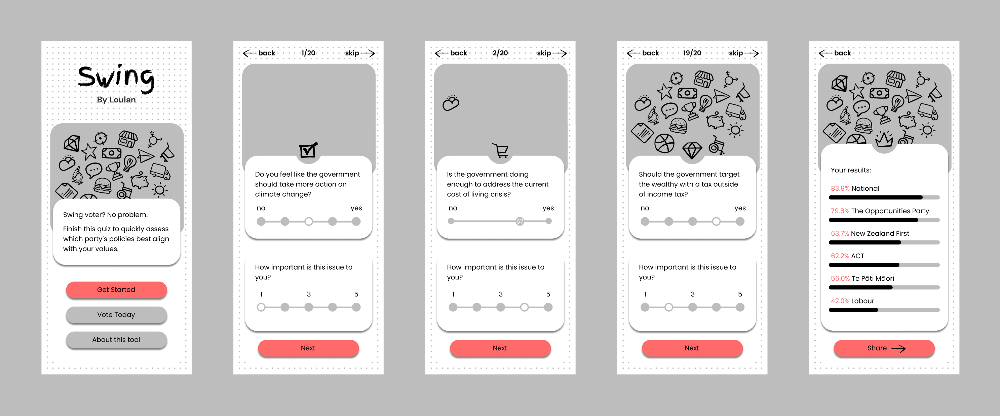

# Swing - New Zealand Political Party Quiz

<p align="center">

</p>

## An interactive political quiz application designed to help first-time and undecided voters make informed decisions in New Zealand elections by matching their values with political party policies.

[](https://nextjs.org/)
[](https://react.dev/)
[](https://www.typescriptlang.org/)
[](https://tailwindcss.com/)
[](https://zustand-demo.pmnd.rs/)
[](https://vercel.com/)

<br />

## Table of Contents 📑
- [Features](#features-)
- [Demo](#demo-)
- [Tech Stack](#tech-stack-)
- [Project Structure](#project-structure-)
- [Data Models](#data-models-)
- [Getting Started](#getting-started-)
  - [Installation](#installation)
  - [Running Locally](#running-locally)
- [How It Works](#how-it-works-)
- [Development Team](#development-team-)
- [Deployment](#deployment-)
- [License](#license-)

<br />

## Features ✨

- **Interactive Political Quiz**: 20 carefully crafted questions covering key political issues
- **Bilingual Support**: Full English and Te Reo Māori language options
- **Smart Scoring Algorithm**: Real-time calculation of party alignment based on user responses
- **Importance Weighting**: Users can indicate how important each issue is to them
- **Comprehensive Party Coverage**: Includes Green, National, Labour, TPM, ACT, and TEST parties
- **Responsive Design**: Optimized for all devices from mobile to desktop
- **Type-Safe Development**: Full TypeScript implementation for robust code quality
- **Modern State Management**: Zustand with Immer for efficient state updates
- **Accessible UI**: Built with accessibility best practices in mind

<br />

## Demo 🎬

We have a deployed WIP and technical evaluation deployed with Vercel. Visit the [live application](https://swing-zeta.vercel.app/) where you'll soon be able to take the quiz and discover which New Zealand political party aligns with your values.

<br />

## Tech Stack ⚙️

This application is built with modern web technologies:

- **[Next.js 13](https://nextjs.org/)**: React framework with App Router for improved performance and SEO
- **[React 18](https://react.dev/)**: Latest React with concurrent features and improved performance
- **[TypeScript 5.1](https://www.typescriptlang.org/)**: Type safety and enhanced developer experience
- **[Tailwind CSS 3.3](https://tailwindcss.com/)**: Utility-first CSS framework for rapid UI development
- **[Zustand 4.3](https://zustand-demo.pmnd.rs/)**: Lightweight state management with Immer integration
- **[Immer](https://immerjs.github.io/immer/)**: Immutable state updates for predictable data flow

<br />

## Project Structure 📁

```
swing/
├── app/                           # Next.js 13 App Router
│   ├── components/                # Reusable UI components
│   │   ├── QuestionCard.tsx       # Individual question display
│   │   ├── Results.tsx            # Results visualization
│   │   ├── ResultsStats.tsx       # Party score statistics
│   │   └── ...                    # Other UI components
│   ├── question/[slug]/           # Dynamic question pages
│   ├── results/                   # Results page and components
│   ├── info/                      # Information and about page
│   └── globals.css                # Global styles and Tailwind config
├── lib/                           # Core business logic
│   ├── dataStore.ts               # Zustand store with state management
│   ├── questions.ts               # Quiz questions and options data
│   ├── partyStances.ts            # Political party positions on issues
│   └── partyScoresCalculator.ts   # Scoring algorithm implementation
├── models/                        # TypeScript type definitions
│   ├── Question.ts                # Question structure interface
│   ├── Answer.ts                  # User answer with importance weighting
│   ├── PartyScore.ts              # Party scoring model
│   ├── DataState.ts               # Global application state
│   └── Options.ts                 # Answer options interface
└── public/                        # Static assets and SVG icons
```

<br />

## Data Models 🏗️

The application uses a well-structured TypeScript architecture:

### Core Interfaces

**Question**: Bilingual question structure
```typescript
interface Question {
  id: number
  englishQuestion: string
  englishOptions: Options
  teReoQuestion: string
  teReoOptions: Options
}
```

**Answer**: User response with importance weighting
```typescript
interface Answer {
  answer: number | null        // User's selected option (1-5 scale)
  importance?: number | null   // How important this issue is (1-100)
}
```

**PartyScore**: Real-time calculated party alignment
```typescript
interface PartyScore {
  partyName: string           // Political party name
  score: number              // Calculated alignment score
}
```

**DataState**: Global application state
```typescript
interface DataState {
  answers: Answer[]           // Array of 20 user answers
  partyScores: PartyScore[]   // Scores for 6 political parties
}
```

<br />

## Getting Started 🚀

### Installation

Clone the repository and install dependencies:

```bash
# Clone the repository
git clone https://github.com/doilyuser/swing.git
cd swing

# Install dependencies
npm install
```

### Running Locally

Start the development server:

```bash
npm run dev
```

Visit [http://localhost:3000](http://localhost:3000) to see the application.

Other available commands:
```bash
npm run build    # Build for production
npm run start    # Start production server
npm run lint     # Run ESLint
```

<br />

## How It Works 🔧

1. **Question Flow**: Users progress through 20 political questions covering key issues
2. **Answer Collection**: Each response is stored with optional importance weighting
3. **Real-time Scoring**: The scoring algorithm calculates party alignment using:
   - User's answer position on a 1-5 scale
   - Party's known stance on each issue
   - Importance weighting applied by the user
   - Mathematical difference calculation for alignment scoring
4. **Results Display**: Visual representation of party alignment percentages
5. **Bilingual Support**: All content available in English and Te Reo Māori

The scoring algorithm considers the mathematical difference between user positions and party stances, weighted by issue importance, providing nuanced and personalized results.

<br />

## Development Team 👥

**Product Owner**: [Louis Dyer](https://github.com/doilyuser)

**Back-End Lead**: [Dylan Guthrie](https://github.com/dylan-guthrie-wickens)

**Front-End Lead**: [Humaidi 'Ado' Ridwan](https://github.com/humaidiar)

**Political Advisor**: [Allanah Lovelady](https://www.linkedin.com/in/allanah-lovelady-2a41b982/)

<br />

## Deployment 🌐

This application is deployed on [Vercel](https://vercel.com/) with automatic deployments from the main branch.

**Live Application**: [swing-zeta.vercel.app](https://swing-zeta.vercel.app/)

The application is optimized for Vercel's platform with:
- Automatic builds on push
- Edge function optimization
- Global CDN distribution
- Performance monitoring

<br />

## License 📄

This project is open source and available under the [MIT License](LICENSE).
